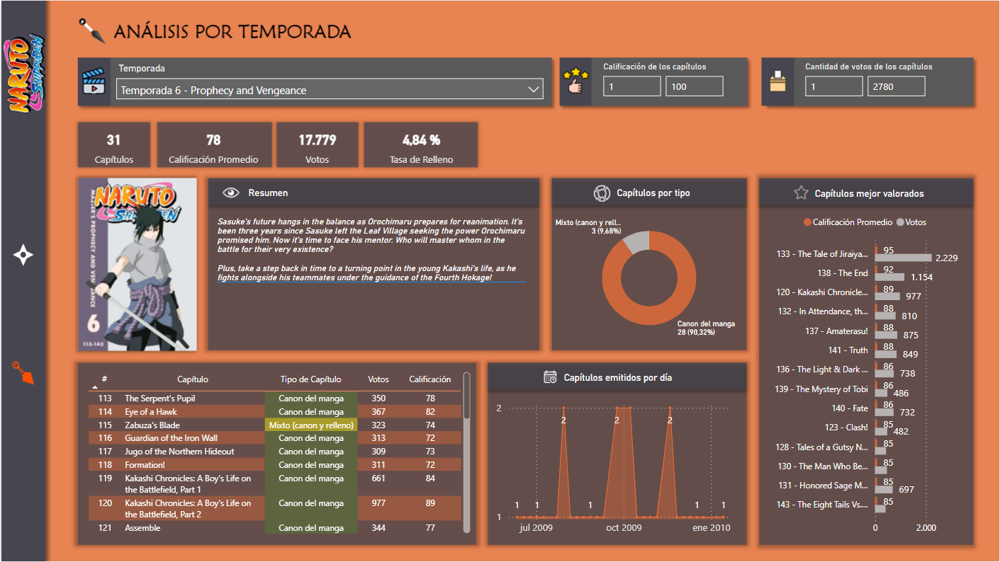

# 📊 Naruto Shippuden - Dashboard en Power BI

Proyecto en el que analizo datos de la serie *Naruto Shippuden* utilizando Power BI. Como fuente de datos se utiliza una planilla csv decargada desde Kaggle que contiene datos de cada capitulo de la serie como su valoración y cantidad de votos considerados, además de señalar si el capitulo pertenece al canon del manga o si es relleno. Incluye integración con una API externa a TMDB para obtener portadas y descripciones de cada temporada.

## 🎯 Objetivos del proyecto
- Practicar visualización de datos temáticos.
- Aplicar diseño UX/UI orientado a storytelling.
- Usar medidas DAX avanzadas.
- Conexiones con APIs externas.

## 🧩 Contenido del informe
- Página 1: Análisis General.
- Página 2: Análisis por Temporada.

## 📷 Captura

## 🛠️ Tecnologías
- Power BI Desktop.
- DAX.
- API externa para metadata.
- Diseño visual con íconos e interfaz temática.

## ⚠️ Nota
Este es un prototipo con fines educativos y personales. No tiene fines comerciales.
